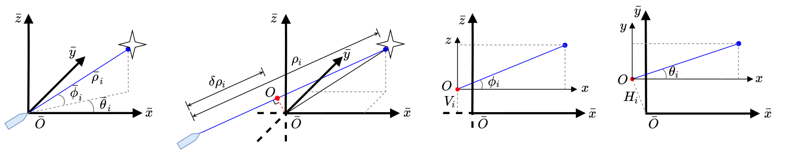

# OA-LICalib: Observability-Aware Intrinsic and Extrinsic Calibration of LiDAR-IMU Systems

**OA-LICalib** is a versatile and highly repeatable calibration method for the LiDAR-inertial system within a continuous-time batch-optimization framework, where the intrinsics of both sensors and the spatial-temporal extrinsics between sensors are calibrated comprehensively without explicit hand-crafted targets. To improve efficiency and cope with challenges from degenerate motions, we introduce two dedicated modules to enable observability-aware calibration. Firstly, a data selection policy based on the information-theoretic metric selects informative segments for calibration in unconscious data collection process. Secondly, an observability-aware state update mechanism in the back-end optimization is introduced to update only the identifiable directions of the calibrated parameters by leveraging truncated singular value decomposition. In this way, the proposed method can get accurate calibration results even under degenerate cases where informative enough data segments do not exist. Extensive evaluations by both simulated and real-world experiments are carried out. The results demonstrate the high accuracy and repeatability of the proposed method in common human-made scenarios and various robot platforms.

## Install

```
# init ROS workspace
mkdir -p ~/catkin_oa_calib/src
cd ~/catkin_oa_calib/src
catkin_init_workspace

# Clone the source code for the project and build it. 
git clone https://github.com/APRIL-ZJU/OA-LICalib.git

# ndt_omp, ros_rslidar
wstool init
wstool merge OA-LICalib/depend_pack.rosinstall
wstool update

# thirdparty
cd OA-LICalib
./build_submodules.sh

## build
cd ../..
catkin_make -DCATKIN_WHITELIST_PACKAGES="ndt_omp"
catkin_make -DCATKIN_WHITELIST_PACKAGES=""
source ./devel/setup.bash
```

## Intrinsic and Extrinsic Calibration



The intrinsics of an individual laser comprising a multi-beam 3D LiDAR.

A example to calibrate extrinsics between LiDAR and IMU while simultaneously calibrating intrinsics of both LiDAR and IMU in simulation. You can find simulated data at [`./data/bag/simu_bag.bag`]. 
The ground truth of intrinsics are at `[./data/bag]` and of extrinsics are as follows:

```yaml
P_LinI [0.30, 0.15, 0.05] meter
euler_LtoI [1.0, 2.0, 5.0] degree
```
Check the  parameter `path_bag` in the `config/simu.yaml`, **change it to your absolute path**. Then run it!

```shell
roslaunch oa_licalib li_calib.launch
```

After completing calibration, run the following script to check the calibration result.

```python
cd script
python plot_lidar_intrinsic_data.py
```

## Observability-Aware Calibration

The code of observability-awared module and the simulator would be released in the near future.

## Credits

This code was developed by the [APRIL Lab](https://april.zju.edu.cn/) in Zhejiang University. For researchers that leveraged this work, please cite the
following:

```txt
@Conference{lv2020targetless,
  title={Targetless calibration of lidar-imu system based on continuous-time batch estimation},
  author={Lv, Jiajun and Xu, Jinhong and Hu, Kewei and Liu, Yong and Zuo, Xingxing},
  booktitle={2020 IEEE/RSJ International Conference on Intelligent Robots and Systems (IROS)},
  pages={9968--9975},
  year={2020},
  organization={IEEE}
}
@Journal{lv2022,
  Title      = {{OA-LICalib}: Observability-Aware Intrinsic and Extrinsic Calibration of LiDAR-IMU Systems},
  Author     = {Jiajun Lv, Xingxing Zuo, Kewei Hu,  Jinhong Xu, Guoquan Huang, and Yong Liu},
  Year       = {2022},
  Url        = {\url{https://github.com/APRIL-ZJU/OA-LICalib}}
}
```

## License

The code is provided under the [GNU General Public License v3 (GPL-3)](https://www.gnu.org/licenses/gpl-3.0.txt).
