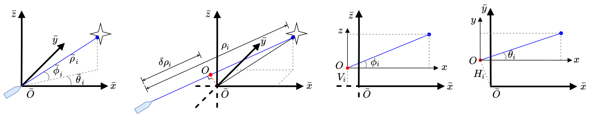
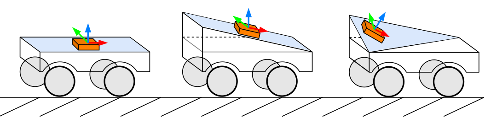

## Observability-aware Intrinsic and Extrinsic Calibration of LiDAR-IMU System

**OA-LICalib** is a versatile and highly repeatable calibration method for the LiDAR-inertial system within a continuous-time batch-optimization framework, where the intrinsics of both sensors and the spatial-temporal extrinsics between sensors are calibrated comprehensively without explicit hand-crafted targets. To improve efficiency and cope with challenges from degenerate motions, we introduce two dedicated modules to enable observability-aware calibration. Firstly, a data selection policy based on the information-theoretic metric selects informative segments for calibration in unconscious data collection process. Secondly, an observability-aware state update mechanism in the back-end optimization is introduced to update only the identifiable directions of the calibrated parameters by leveraging truncated singular value decomposition. In this way, the proposed method can get accurate calibration results even under degenerate cases where informative enough data segments do not exist. Extensive evaluations by both simulated and real-world experiments are carried out. The results demonstrate the high accuracy and repeatability of the proposed method in common human-made scenarios and various robot platforms. 

The source code will be available after the publication of the related paper.

The intrinsics of an individual laser comprising a multi-beam 3D LiDAR. 

Simulation to examine observability awareness: three mounting setups with different relative orientations between the robot and the LiDAR-IMU sensor rig.